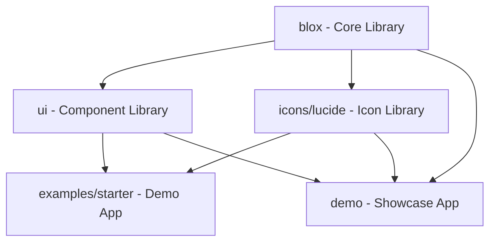

# ⚡ BloxUI Organization

> **Modern, type-safe HTML component library for Go with compile-time guarantees and zero runtime overhead.**

BloxUI is a revolutionary approach to building HTML interfaces in Go. Instead of templates or struct-based builders, BloxUI uses pure functions with compile-time type safety, automatic asset collection, and beautiful design components.

---

## 🏗️ Architecture Overview



## 📦 Repositories

### Core Infrastructure

- **[blox](https://github.com/bloxui/blox)** - The core HTML component library
  - Type-safe HTML generation
  - Compile-time validation
  - Zero runtime overhead
  - Asset collection system

- **[ui](https://github.com/bloxui/ui)** - Pre-built UI component library
  - shadcn/ui inspired components
  - Accessible and responsive
  - Modern design system
  - CSS-in-Go approach

### Icons & Assets

- **[icons](https://github.com/bloxui/icons)** - Beautiful icon libraries
  - **lucide** - 1000+ beautiful, consistent icons
  - Type-safe icon components
  - Customizable size and styling
  - Tree-shakeable imports

### Examples & Demos

- **[examples/starter](./examples/starter)** - Production-ready starter template
  - Complete CRUD application
  - User management system
  - Modal interactions
  - Beautiful dashboard design

- **[demo](./demo)** - Interactive showcase application
  - Component demonstrations
  - Live code examples
  - Feature highlights
  - Performance benchmarks

## 🚀 Quick Start

```go
package main

import (
    x "github.com/bloxui/blox"
    "github.com/bloxui/icons/lucide"
    "github.com/bloxui/ui"
)

func main() {
    page := ui.Card(
        ui.CardHeader(
            ui.CardTitle(
                x.Div(
                    x.Class("flex items-center gap-2"),
                    lucide.Zap(lucide.Size("20")...),
                    x.Text("Welcome to BloxUI!"),
                ),
            ),
        ),
        ui.CardContent(
            x.P(x.Text("Build beautiful interfaces with type safety.")),
            ui.Button(
                x.Class("mt-4"),
                lucide.Rocket(lucide.Size("16")...),
                x.Text("Get Started"),
            ),
        ),
    )

    html := x.Render(page)
    // Serve your beautiful HTML! 🎉
}
```

## ✨ Key Features

### 🛡️ **Type Safety**
- Compile-time HTML validation
- Invalid attribute combinations fail at build time
- IDE autocomplete and type hints
- Refactoring safety

### ⚡ **Performance**
- Zero runtime overhead
- Pure function calls
- Compile-time HTML generation
- Minimal memory allocation

### 🎨 **Beautiful Design**
- shadcn/ui inspired components
- Consistent design system
- Responsive and accessible
- Modern CSS practices

### 🔧 **Developer Experience**
- Fluent, chainable API
- Automatic asset collection
- CSS and JS co-location
- Hot reload support

### 🧩 **Composability**
- Build complex UIs from simple components
- Reusable and testable
- Easy component sharing
- Asset deduplication

## 🎯 Use Cases

- **Web Applications** - Full-stack Go applications with beautiful UIs
- **Admin Dashboards** - Data-heavy interfaces with rich interactions
- **Marketing Sites** - Static sites with modern design
- **Component Libraries** - Shareable UI component packages
- **Prototyping** - Rapid UI development with type safety

## 🏆 Why BloxUI?

| Feature | BloxUI | HTML Templates | React/Vue |
|---------|--------|----------------|-----------|
| **Type Safety** | ✅ Compile-time | ❌ Runtime errors | ⚠️ TypeScript needed |
| **Performance** | ✅ Zero overhead | ✅ Server-side | ❌ Client runtime |
| **IDE Support** | ✅ Full autocomplete | ⚠️ Limited | ✅ Good with TS |
| **Refactoring** | ✅ Safe renames | ❌ Find & replace | ⚠️ With tooling |
| **Asset Management** | ✅ Automatic | ❌ Manual | ⚠️ Build tools |
| **Learning Curve** | ✅ Just Go | ⚠️ Template syntax | ❌ New framework |

## 🌟 Community

- **GitHub Discussions** - Ask questions and share ideas
- **Issues** - Bug reports and feature requests
- **Contributing** - We welcome contributions!
- **Examples** - Share your BloxUI projects

## 🗺️ Roadmap

### ✅ **Completed**
- Core HTML component system
- Type-safe attribute system
- Asset collection & injection
- Lucide icon integration
- Basic UI component library
- Example applications

### 🚧 **In Progress**
- Extended UI component library
- Advanced form components
- Animation system
- Theme customization

### 📋 **Planned**
- More icon libraries
- Component testing utilities
- Storybook-like documentation
- VS Code extension
- Performance monitoring
- Enterprise components

## 🤝 Contributing

We love contributions! Whether it's:

- 🐛 **Bug fixes** - Help us squash bugs
- ✨ **New features** - Add awesome functionality
- 📚 **Documentation** - Improve our docs
- 🎨 **Design** - Make things more beautiful
- 💡 **Ideas** - Share your thoughts

Check out our [Contributing Guide](CONTRIBUTING.md) to get started!

## 📄 License

BloxUI is MIT licensed. Build amazing things! 🚀

---

<div align="center">

**Built with ❤️ by the BloxUI team**

[Website](https://bloxui.dev) • [Documentation](https://docs.bloxui.dev) • [Examples](./examples) • [Discord](https://discord.gg/bloxui)

</div>